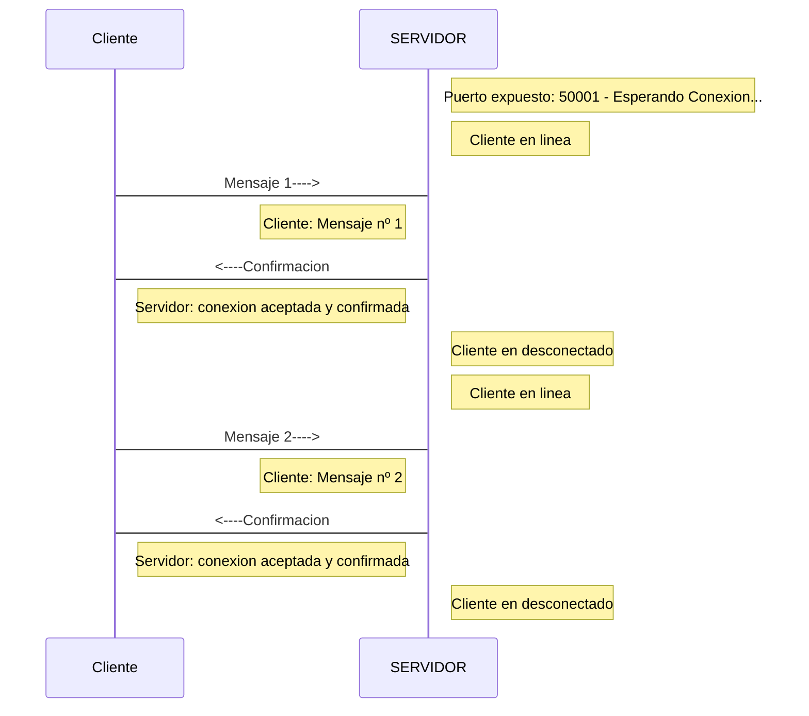

### Introduccion
En enlace TCP entre se establece un camino virtual entre servidor y cliente, fiable, sin pérdidas de información ni
duplicados, la información llega en el mismo orden que se envía.

El cliente abre una sesion en el servidor y este guarda un estado del cliente.


## Sobre este proyecto
Se trata de un servidor que expone el puerto 50001 para aceptar peticiones de otros hosts clientes y notifica al host sobre la recepcion de los mensajes.

* * *



## Conexion TCP entre Cliente & Servidor.
El cliente utiliza la clase `Socket`.
- Implementa la conexión desde el lado del cliente.

El servidor utiliza la clase `ServerSocket`.
- Permite manipular la conexión desde el lado del servidor.

### **Clase Servidor**.

>1. En el servidor exponemos el puerto 50001 para acceptar conexiones con otros hosts cliente.
>2. Una vez aceptamos la conexion mandamos un mensaje de confirmacion al host cliente.
>3. Recibimos el mensaje del host cliente.
>4. Cerrramos la conexion.
```java
public class Servidor {
 
      static  ServerSocket servidor;
      static  Socket sc;
      static  DataInputStream in;
      static  DataOutputStream out;
      static final int PUERTO = 53000; //Puerto expuesto en el servidor
 
 
    public static void main(String[] args) {
 
    
       
        try {
            
            //Habilitamos la conexion contra el servidor reservando el puerto 5300
            servidor = new ServerSocket(PUERTO);
            System.out.println("Servidor iniciado");
 
            //Espero a que llegue informacion desde socket del servidor
            while (true) {
 
                //Acepto la conexion del cliente
                sc = servidor.accept();

                //Habilito la entrada/salida de info con el cliente
                in = new DataInputStream(sc.getInputStream());
                out = new DataOutputStream(sc.getOutputStream());
                
                //Notifico de la conexion en el servidor
                System.out.println("Cliente conectado");
                
                //Notifico de la conexion en el cliente
                out.writeUTF("Servidor: conexion aceptada y confirmada");               
              
         
                //Codifico a UTF la informacion entrante del cliente
                String mensaje = in.readUTF();
              
                //Muestro el mensaje del hostcliente
                System.out.println(mensaje);
                //Cierro el socket
                sc.close();
                System.out.println("Cliente desconectado");
 
            }
 
        } catch (IOException ex) {
            Logger.getLogger(Servidor.class.getName()).log(Level.SEVERE, null, ex);
        }
    }
}
 
}
```


### **Clase Cliente**
> 1. Seteamos IP y Puerto (Socket)
> 2. Enviamos un mensaje al servidor
> 3. Recibimos cualquier mensaje del servidor
> 4. Cerramos conexion
> 5. Repetimos 2 veces
```java
public class Cliente {
 
    public static void main(String[] args) {
 
        //Host del servidor
        final String HOST = "127.0.0.1";
        //Puerto del servidor
        final int PUERTO = 53000;
        DataInputStream in;
        DataOutputStream out;
 
        try {
            
            for (int i = 1; i <= 2; i++) {
                
            //Creo el enlace con el servidor
            Socket sc = new Socket(HOST, PUERTO);
 
            //Habilito la entrada de informacion desde el servidor
            in = new DataInputStream(sc.getInputStream());
            
            //Habilito la salida de informacion hacia el servidor
            out = new DataOutputStream(sc.getOutputStream());
 
            //Envio un mensaje al servidor codificado en UTF
            out.writeUTF("Cliente: Mensaje nº"+i);
 
            //Codifico a UTF la informacion que llega desde del servidor
            String mensaje = in.readUTF();
 
            //La muestro por pantalla
            System.out.println(mensaje);
            
            //Cierro conexion
            sc.close();
            }
            
 
        } catch (IOException ex) {
            Logger.getLogger(Cliente.class.getName()).log(Level.SEVERE, null, ex);
        }
 
    }
 
}
```


[Basado en este ejemplo](https://www.discoduroderoer.es/ejemplo-conexion-tcp-clienteservidor-en-java/#:~:text=La%20conexi%C3%B3n%20TCP%20es%20orientada,seria%20el%20c%C3%B3digo%20del%20cliente)


